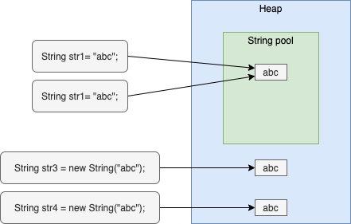

`String` trong Java được lưu trữ như sau



- Biến `String` được tạo bằng toán tử `==` được lưu trữ trong StringPool. Mỗi giá trị nằm trong một vùng nhờ trong String pool. Các biến cùng giá trị tham khảo đến vùng nhờ này.
Giá trị vùng nhớ này sẽ không bị thay đổi. Việc thay đổi giá trị một biến String sẽ tạo ra vùng nhớ mới chưa giá trị mới.

```java
String str1 = "abc";
String str2 = "abc";
System.out.println("Compare str1==str2: " + (str1==str2));
``` 

```shell
$ mvn clean package
$ java -jar string-pool/target/string-pool-0.0.1-SNAPSHOT.jar
Compare str1==str2: true
```

- Biến `String` được tạo bằng toán tử `new` được lưu trữ trong vùng nhờ Heap. Mỗi biến sẽ có giá trị nằm trong vùng các vùng nhớ khác nhau.

```java
String str3 = new String("abc");
String str4 = new String("abc");
System.out.println("Compare str3==str4: " + (str3==str4));
``` 

```shell
$ mvn clean package
$ java -jar string-pool/target/string-pool-0.0.1-SNAPSHOT.jar
Compare str3==str4: true
```

- So sánh giá trị 2 biến `String` bằng toán tử `equal`

```java
System.out.println("Compare value str1.equals(str3): " + (str1.equals(str3)));
```

```shell
$ mvn clean package
$ java -jar string-pool/target/string-pool-0.0.1-SNAPSHOT.jar
Compare value str1.equals(str3): true
```` 

[1]: https://pages.github.com