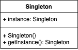

- *Singleton * là pattern tạo ra một instance duy nhất của một class

```java
public class Singleton {

  private static final Singleton instance = new Singleton();

  public Singleton() {
    //Do something in constructor
  }

  public static Singleton getInstance() {
    
    return instance;
  }
}
``` 

- *Lazy singleton* để tạo ra instance khi được gọi

```java
public class LazySingleton {

  private static LazySingleton instance;

  public LazySingleton() {
    //Do something in constructor
  }

  public static LazySingleton getInstance() {
    if (instance == null) {
      instance = new LazySingleton();
    }

    return instance;
  }
}
``` 

- *Double checked singleton* tạo singleton trong môi trường mutilthread

```java
public class DoubleCheckedSingleton {

  private static DoubleCheckedSingleton instance;

  public DoubleCheckedSingleton() {
    //Do something in constructor
  }

  public static DoubleCheckedSingleton getInstance() {
    if (instance == null) {
      synchronized (DoubleCheckedSingleton.class) {
        if (instance != null) {
          instance = new DoubleCheckedSingleton();
        }
      }
    }

    return instance;
  }
}
```

- *BillPugh singleton* tạo singleton bằng cách sử dụng static inner class

```java
public class BillPughSingleton {

  private BillPughSingleton(){}

  private static class SingletonHelper {

    private static final BillPughSingleton INSTANCE = new BillPughSingleton();
  }

  public static BillPughSingleton getInstance() {

    return SingletonHelper.INSTANCE;
  }
}
```` 