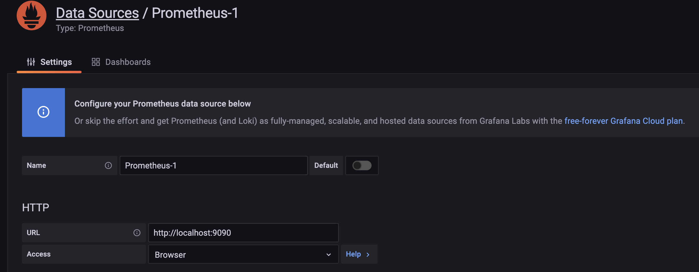
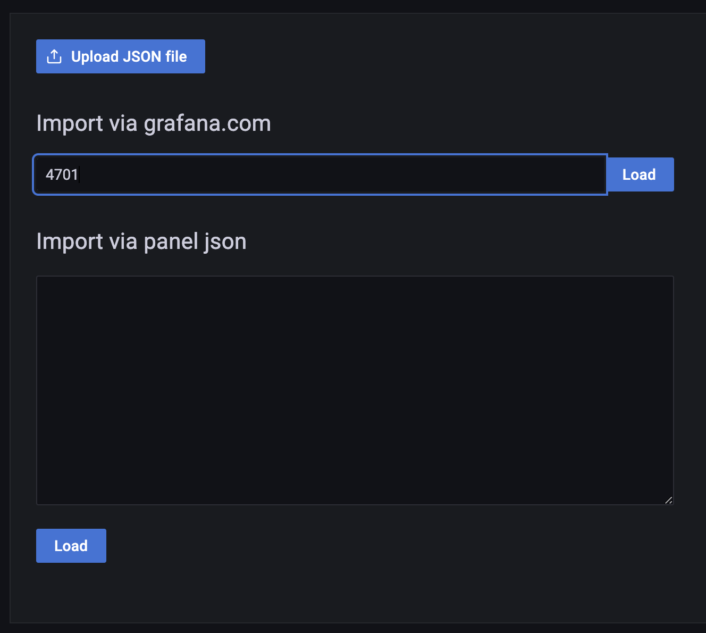
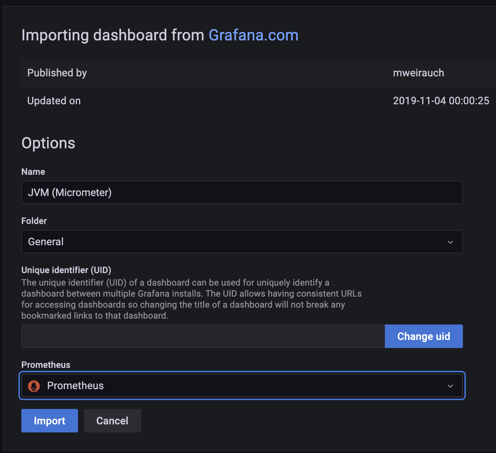
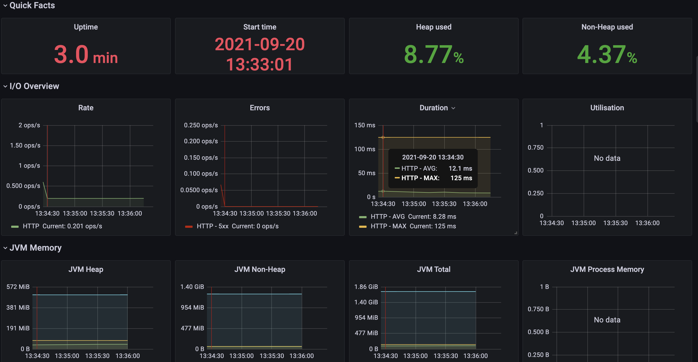
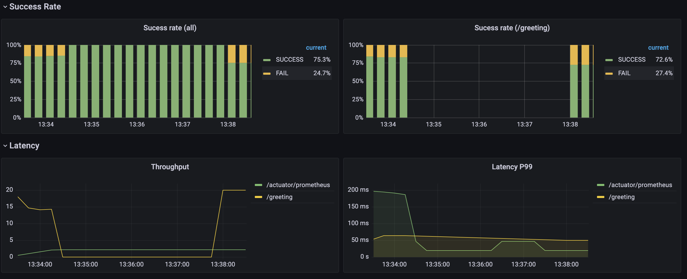

<div align="center">
    
</div>

> Hướng dẫn monitor Spring Boot application bằng Promethues và Grafana

- Thư viện sử dụng
  - [spring-boot-actuator](https://docs.spring.io/spring-boot/docs/current/reference/html/actuator.html)
  - [Micrometer.io](https://micrometer.io/)
  - [Promethues](https://prometheus.io/)
  - [Grafana](https://grafana.com/)

## Tạo một spring-boot application 

- Thêm dependency trong file pom.xml

```xml
        <!--  actuator  -->
        <dependency>
          <groupId>org.springframework.boot</groupId>
          <artifactId>spring-boot-starter-actuator</artifactId>
        </dependency>
    
    		<!--  micrometer  -->
        <dependency>
          <groupId>io.micrometer</groupId>
          <artifactId>micrometer-registry-prometheus</artifactId>
        </dependency>
```

- Thêm dependency trong pom.xml

```xml
		<dependency>
			<groupId>net.devh</groupId>
			<artifactId>grpc-spring-boot-starter</artifactId>
			<version>2.12.0.RELEASE</version>
		</dependency>
``` 

- Thêm config cho micrometer trong file application.yml

```yml
management:
  endpoints:
    web:
      exposure:
        include: health, shutdown, prometheus
  metrics:
    tags:
      application: ${spring.application.name}
    export:
      prometheus:
        enabled: true
    distribution:
      percentiles-histogram:
        http: false
      sla:
        http:
          server:
            requests: 1ms,20ms,50ms,100ms,200ms,500ms,1s,2s,5s,10s,10s,50s
```

- Thêm các class cần thiết và start một Restfull service

- Kiểm tra các đường dẫn actuator quản lý

```shell
$ curl -X GET http://localhost:8081/actuator
{"_links":{"self":{"href":"http://localhost:8081/actuator","templated":false},"health":{"href":"http://localhost:8081/actuator/health","templated":false},"health-path":{"href":"http://localhost:8081/actuator/health/{*path}","templated":true},"prometheus":{"href":"http://localhost:8081/actuator/prometheus","templated":false}}}
```

- Xem các metrics cho prometheus

```shell
$ curl -X GET http://localhost:8081/actuator/prometheus
...
http_server_requests_seconds_max{exception="None",method="GET",outcome="SUCCESS",status="200",uri="/actuator/prometheus",} 0.2230911
http_server_requests_seconds_max{exception="None",method="GET",outcome="SUCCESS",status="200",uri="/actuator",} 0.2658599
http_server_requests_seconds_max{exception="None",method="GET",outcome="CLIENT_ERROR",status="404",uri="/**",} 0.033111
# HELP process_cpu_usage The "recent cpu usage" for the Java Virtual Machine process
# TYPE process_cpu_usage gauge
process_cpu_usage 0.009735744089012517
...
```

## Cài đặt prometheus & grafana

- File docker-compose.yml

```yaml
version: "3.4"

services:
  spring-boot-prometheus-grafana:
    build: ./spring-boot-prometheus-grafana
    ports:
      - "8081:8081"
    container_name: spring-boot-prometheus-grafana
    networks:
      - prometheus-grafana-network
  prometheus:
    image: "prom/prometheus"
    volumes:
      - ./infrastructure/prometheus.yml:/etc/prometheus/prometheus.yml
    ports:
      - "9090:9090"
    container_name: prometheus
    networks:
      - prometheus-grafana-network
  grafana:
    image: "grafana/grafana"
    ports:
      - "3000:3000"
    container_name: grafana
    networks:
      - prometheus-grafana-network
    volumes:
      - grafana-storage:/var/lib/grafana
volumes:
  grafana-storage:
    external: true
networks:
  prometheus-grafana-network:
```

- Với file config prometheus.yml

```yaml
scrape_configs:
  - job_name: 'spring-boot-prometheus-grafana-metrics'
    metrics_path: '/actuator/prometheus'
    scrape_interval: 5s
    static_configs:
      - targets: [ 'spring-boot-prometheus-grafana:8081' ]
```

- Start docker-compose

```shell
$ docker-compose up -d
```

- Mở browser và truy cập tool qua link sau
    - Promethues: http://localhost:9090/
    - Grafana: http://localhost:3000/ , tài khoản mặc định là admin/admin

## Tạo dashboard trên Grafana

### Dashboard monitor JVM metric

- Setup Prometheus datasource



- Tạo dashboard cho JVM metric bằng cách import id [4701](https://grafana.com/grafana/dashboards/4701)



- Dashboard hiển thị như bên dưới




### Dashboard monitor api 
- Success Rate
    + Metric 1
    
```text
sum(increase(http_server_requests_seconds_bucket{application="$application", instance="$instance", status="200"}[1m]))
/
sum(increase(http_server_requests_seconds_bucket{application="$application", instance="$instance"}[1m]))
```

    + Metric 2
    
```text
sum(increase(http_server_requests_seconds_bucket{application="$application", instance="$instance", status!="200"}[1m]))
/
sum(increase(http_server_requests_seconds_bucket{application="$application", instance="$instance"}[1m]))
```


- Metric B
```text
sum(increase(http_server_requests_seconds_bucket{uri="/greeting", status!="200"}[1m]))
/
sum(increase(http_server_requests_seconds_bucket{uri="/greeting"}[1m]))
```

- Throughput

```text
sum(rate(http_server_requests_seconds_bucket{application="$application", instance="$instance"}[1m])) by (uri)
```

- Latency P99

```text
histogram_quantile(0.99, sum(rate(http_server_requests_seconds_bucket{application="$application", instance="$instance"}[1m])) by (le, uri))
```


