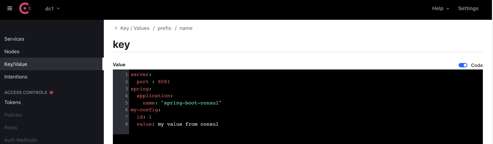

<div align="center">
    
</div>

> Hướng dẫn sử dụng Consul configuration trong Spring Boot application

## Tạo ứng dụng

- Trong ứng dụng Spring Boot, config được đặt trong file application.yml (hoặc .properties). Tạo một project với file configuration application.yml như sau

```yaml
server:
  port : 8081
spring:
  application:
    name: "spring-boot-consul"
my-config:
  id: 1
  value: my value
``` 

- Tạo class lấy config từ file 

```java
@Getter
@Setter
@Configuration
@ConfigurationProperties(prefix = "my-config")
public class MyConf {

  private int id;
  private String value;

}
```

- Tạo class autowired bean `MyConf` và sử dụng

```java
    @Autowired
	MyConf myConf;

	@Value("${spring.application.name}")
	String applicationName;

	@EventListener(ApplicationReadyEvent.class)
	protected void readyProcess() {
		System.out.println("Id: " + myConf.getId());
		System.out.println("Value: " + myConf.getValue());

		System.out.println("Application name: " + applicationName);
	}
```

- Kết quả sau khi chạy chương trình

```shell script
$ ./mvnw spring-boot:run
2021-09-29 10:18:22.194  INFO 2892 --- [           main] o.s.b.w.embedded.tomcat.TomcatWebServer  : Tomcat started on port(s): 8081 (http) with context path ''
2021-09-29 10:18:22.201  INFO 2892 --- [           main] i.c.springbootconsul.Application         : Started Application in 3.853 seconds (JVM running for 4.93)
Id: 1
Value: my value
Application name: spring-boot-consul

```

## Sử dụng configuration với Consul

- Thêm dependency [spring-cloud-starter-consul-config](https://cloud.spring.io/spring-cloud-consul/reference/html/)

```xml
    <dependency>
        <groupId>org.springframework.cloud</groupId>
        <artifactId>spring-cloud-starter-consul-config</artifactId>
        <version>2.2.7.RELEASE</version>
    </dependency>
```

- Tạo file bootstrap.yml

```yaml
spring:
  profiles:
    active: locals
  cloud:
    consul:
      host: localhost
      port: 8500
      config:
        enabled: true
        format: YAML
        prefix: prefix #default: config
        name: name
        defaultContext: context #default: application
        profileSeparator: '::'
        data-key: key
```

  - Lưu ý: Project sẽ đọc tất cả các key [key] trong các path sau:
        [prefix]/[name]/
        [prefix]/[name],[active]/
        [prefix]/[default-context]/
        [prefix]/[default-context],[active]/

- Thêm nội dung giống như application.yml trên Consul tại path /prefix/name/key/
Ở đây, ví dụ có thay đổi một số giá trị `value` trong config trên Consul




- Kết quả sau khi chạy chương trình

```shell script
$ ./mvnw spring-boot:run
2021-09-29 10:26:17.441  INFO 3120 --- [           main] b.c.PropertySourceBootstrapConfiguration : Located property source: [BootstrapPropertySource {name='bootstrapProperties-prefix/name::locals/'}, BootstrapPropertySource {name='bootstrapProperties-prefix/name/'}, BootstrapPropertySource {name='bootstrapProperties-prefix/context::locals/'}, BootstrapPropertySource {name='bootstrapProperties-prefix/context/'}]
...
2021-09-29 10:22:02.258  INFO 3057 --- [           main] o.s.b.w.embedded.tomcat.TomcatWebServer  : Tomcat started on port(s): 8081 (http) with context path ''
2021-09-29 10:22:02.266  INFO 3057 --- [           main] i.c.springbootconsul.Application         : Started Application in 5.047 seconds (JVM running for 6.007)
Id: 1
Value: my value from consul
Application name: spring-boot-consul
```
